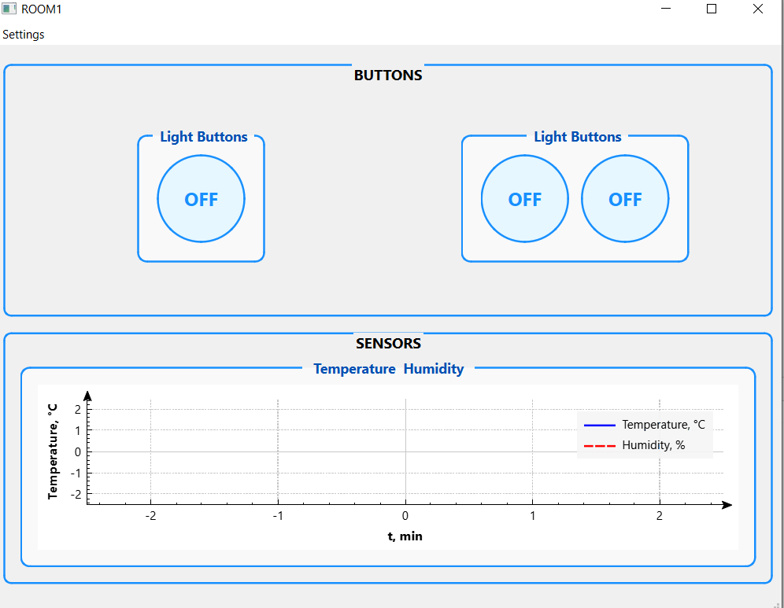
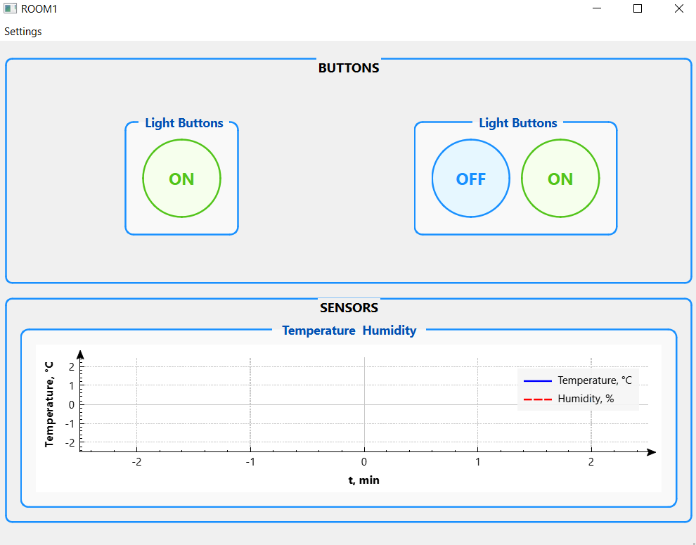
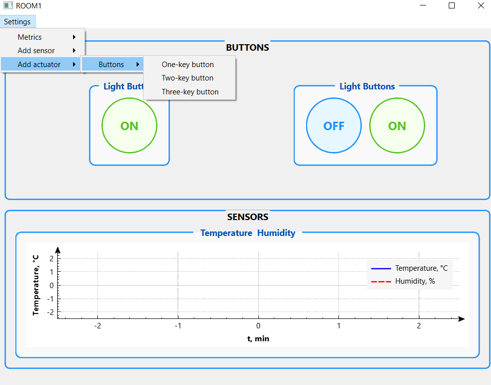

# Smart Switcher

**Smart Switcher** is an intelligent switch system built on ESP32-C3 that allows users to control lighting both locally using physical buttons and remotely via MQTT broker. The system features LED indicators for operation mode and provides an intuitive connection setup via Wi-Fi.

---

## 🚀 Features

- **Local and remote control:** Switch lights using physical buttons or remotely via MQTT.
- **Mode indication:** LED indicates the current operation mode:
  - Slow blink: Wi-Fi connection is active.
  - Long off: No connection.
  - Fast blink: Access Point (AP) mode active — the switch is a Wi-Fi access point.
- **Wi-Fi configuration:** n AP mode, connect to the switch and use the built-in captive portal to input your Wi-Fi credentials (SSID & password) to connect to your network and MQTT broker.
- **MQTT integration:** Publish and subscribe to topics for full remote control.

---

## 🧰 Technologies & Components

- **ESP32-C3** — main microcontroller
- **GPIO** — for button input and LED indication
- **FreeRTOS** — for multitasking and reliable task management
- **Wi-Fi (STA/AP mode)** — supports both connection to network and access point for configuration
- **Captive portal** — simplifies Wi-Fi setup directly from user device
- **MQTT** — lightweight messaging protocol for remote control and integration with IoT systems

---

## 📡 MQTT Command Examples

Below are several example commands for controlling **Smart Switcher** using `mosquitto_pub`.  
These examples demonstrate how to send JSON-based control messages to the device via MQTT.
The examples use a local Mosquitto MQTT broker, but you can use any other MQTT broker of your choice.

### 🔘 Turn a Single Channel ON
```bash
mosquitto_pub -h 192.168.0.102 \
  -t home/rooms/living/lights/id1/cmd \
  -m '{"state": "ON"}'
```

### 🔘 Turn a Single Channel OFF
```bash
mosquitto_pub -h 192.168.0.102 \
  -t home/rooms/living/lights/id1/cmd \
  -m '{"state": "OFF"}'
```

### 🔘 Control Multiple Channels
(Example for a multi-relay Smart Switcher)
```bash
mosquitto_pub -h 192.168.0.102 \
  -t home/rooms/living/lights/id1/cmd \
  -m '{"states": ["OFF", "OFF", "OFF"]}'
```

### 📥 Subscribe to Device State
```bash
mosquitto_sub -h 192.168.0.102 \
  -t home/rooms/living/lights/id1/state
```

## 🔮 Future Plans

The Smart Switcher is designed to become a part of a larger smart home ecosystem.  
At the moment, there is already a desktop application written in **C++ (Qt)** that allows you to control the switch directly from your PC.  
This application will be published in this repository in the future.

Planned improvements include:

- Integration into a full smart home network  
- Enhanced desktop application with real-time monitoring  
- Support for additional devices and sensors  
- Extended automation features  

Below is a preview of the current desktop demo application.  
It already allows you to control the Smart Switcher, send commands, and monitor its state in real time.  
The application will be published in this repository once it reaches a stable release.




